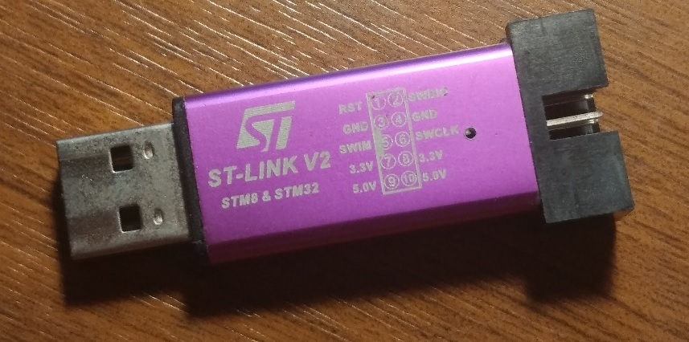

board scripts for stlink v2 clone


Default nucleo scripts expect rst pin to work, which is not the case for those clones.

Around 0.12.0-somethig version openocd changed stlink script directives, `*_oldocd.cfg` contains the older ones.


use with openocd ("config options" in eclipse)

```
-f "board/f0_stlinkv2.cfg"
```

to select one stlink by serial id

```
 -c "hla_serial 00112233445566778899AAFF"
```